# CodeIgniter 4

## 1. Pengertian CodeIgniter

CodeIgniter adalah sebuah framework aplikasi berbasis PHP yang digunakan untuk membangun aplikasi WEB. Framework ini dirancang untuk memudahkan pengembangan aplikasi dengan menyediakan alat dan struktur dasar yang telah siap pakai. Dengan CodeIgniter, pengembang dapat mengembangkan aplikasi web dengan cepat dan efisien karena framework ini menyediakan fitur-fitur seperti manajemen database, pengelolaan URL dan sistem templating. [CodeIgniter 4](https://codeigniter.com).
<br />
<br />

## 2. Instal CodeIgniter Menggunakan Composer

CodeIgniter memiliki dua metode instalasi, yang pertama bisa download secara manual dan yang kedua menggunakan Composer. Disini saya rekomendasikan download CodeIgniter menggunakan Composer karena dapat diperbarui dengan mudah. Caranya yaitu :

A. Instal [Komposer](https://getcomposer.org/) <br />
B. Create CodeIgniter dengan mengetikan perintah dibawah ini pada terminal.

```
composer create-project codeigniter4/appstarter Nama-Project
```

C. Jalankan Server lokal CodeIgniter dengan perintah dibawah ini

```
php spark serve
```

D. Jalankan Project tersebut dengan cara buka browser lalu isikan (http://localhost:8080)
   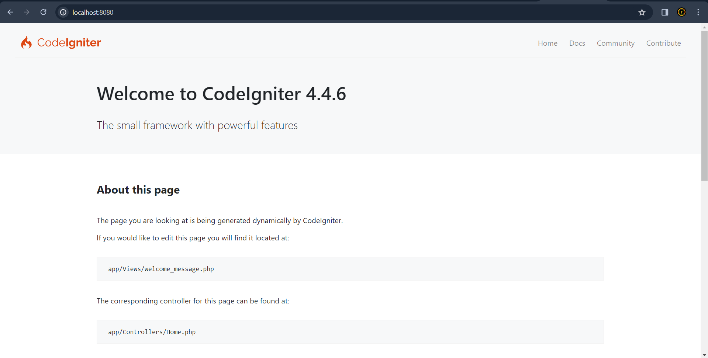

<br />
<br />

## 3. Konfigurasi Awal

untuk mengkonfigurasi $bashURL dapat dilakukan dengan buka project CI tadi, bisa menggunakan Visual Studio Code. lalu pergi ke app/config/app.php. disitu $bashURLnya dapat diubah sesuai URL yang dikehendaki. namun cara tersebut kurang efisien karena jika kita akan mengkonfigurasi data base dan lainya harus mencari satu-satu dari folder tersebut. lalu bagaimana cara yang lebih efisien? disini saya gunakan env yang sudah disediakan. cara menggunakanya yaitu ubah file env menjadi .env , lalu hilangkan komentar atau # lalu ubah sesuai kebutuhan.

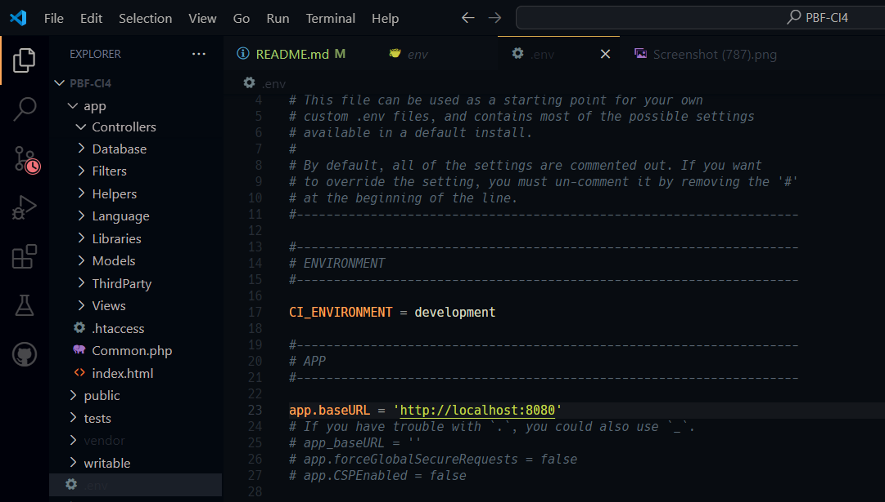

disini saya ubah CI_ENVIRONMEN = produktion menjadi developmen , gunanya yaitu supaya dalam membuat atau mengembangkan aplikasi tersebut maka jika terjadi kesalahan akan muncul eror dibagianmana pada tampilan wibesitenya
lalu menambahkan $bashURL

<br />
<br />

## 4. Aturan Perutean
```
<?php

use CodeIgniter\Router\RouteCollection;

/**
 * @var RouteCollection $routes
 */
$routes->get('/', 'Home::index');

```
kode diatas adalah potongan dari file routes.php yang terletak di app/config/routes.php. maksud dari kode diatas yaitu setiap url yang kita jalankan yaitu localhost8080 maka defaultnya mengarahkan ke class Home method index. contohnya jika kita mengakses url localhost8080 maka akan tampil dibawah ini.
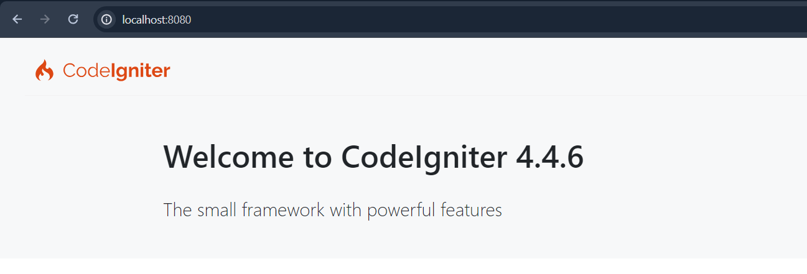
sebenarnya itu adalah http://localhost:8080/Home/index buktikan
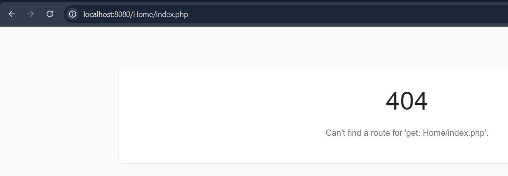
jika eror atau not found tambahkan code dibawah ini
```
$routes->setAutoRoute(true);
```
maka akan tampil seperti semula karena pada dasarnya link tersebut mengarah ke clas Home method index.
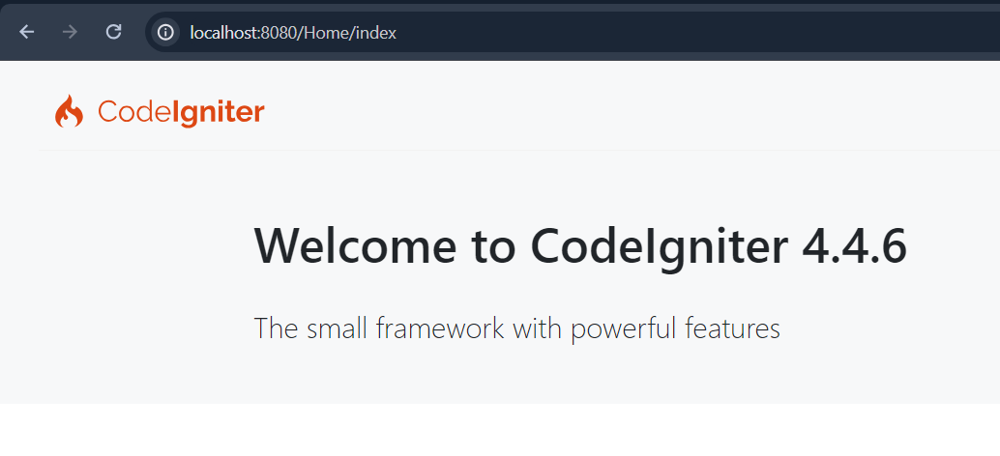

<br />
<br />

## 5. Mengubah akses Route
untuk mengubah akses route yang tadinya 'Home::index' menjadi yang diinginkan misalnya halaman About maka langkah awal yaitu 
1. buat method baru pada Clas Home misal fungsi about dengan nilai kembalian view('about')
```
<?php

namespace App\Controllers;

class Home extends BaseController
{
    public function index(): string
    {
        return view('welcome_message');
    }

    public function about(): string
    {
        return view('about');
    }
}

```
2. buat file baru untuk mengembalikan nilai view yaitu about <br />
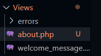 <br />
lalu isikan dengan kode html karena disini masuk ke aturan MVC yaitu view. misal isianya seperti berikut
```
<!DOCTYPE html>
<html lang="en">
<head>
    <meta charset="UTF-8">
    <meta name="viewport" content="width=device-width, initial-scale=1.0">
    <title>Halaman About by Triko</title>
</head>
<body>
    <h1>ini adalah halaman About</h1>
</body>
</html>
```
3. lalu ubah aturan pada routesnya menjadi home::about karena kita akan menuju class home method about
```
$routes->get('/', 'Home::about');
```
maka tampilanya akan berubah menjadi Halaman About


<br />
<br />

## 6. Membuat Halaman Statis dan routesnya
1. buat Controler baru dengan nama Pages
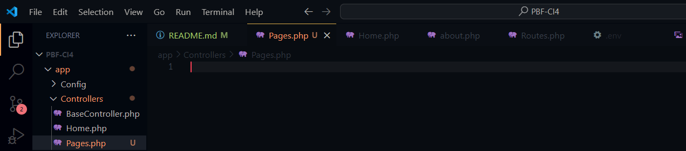
2. lalu isikan file tersebut seperti file home sebelumnya. hanya saja untuk nama classnya disesuiakan. lalu tambahkan fungsi satu lagi yaitu about.
```
<?php

namespace App\Controllers;

class Pages extends BaseController
{
    public function index()
    {
        echo view('pages/index');
    }
    public function about()
    {
        echo view('pages/about');
    }
}

```
2. lalu buat file dengan nama index dan about didalam folder view. namanya disesuaikan dengan controler yang sudah kita buat sebelumnya supaya tidak terjadi eror. supaya lebih rapih saya buat folder baru dengan nama pages lalu didalamnya diisi file tadi.lalu isikan script html, namun disini saya akan membuat halaman statis jadi untuk file index dan about cukup diisi kontennya saja. untuk header dan footer ditempatkan di folder terpisah
```
<h1>Home</h1>
<h5>Ini Adalah Halaman Home</h5>
```
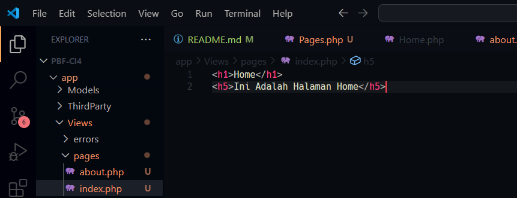
3. lalu ubah routesnya menjadi Pages::index
```
<?php

use CodeIgniter\Router\RouteCollection;

/**
 * @var RouteCollection $routes
 */

$routes->setAutoRoute(true);
$routes->get('/', 'Pages::index');

```
4. kita tes dengan mengetikan url localhost:8080 dan localhost:8080/pages/about
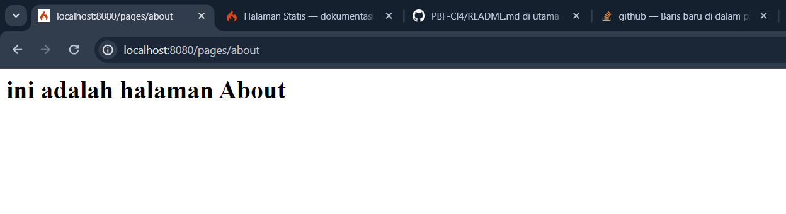
5. tambahkan folder layout di view dan tambahkan didalamnya file dengan nama header dan footer
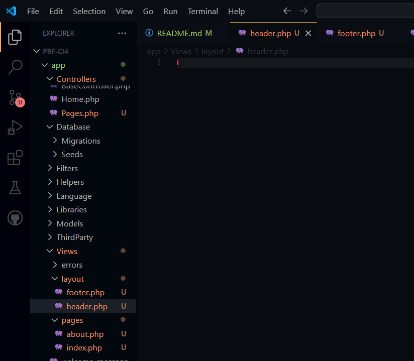
6. buat sript html pada header(Biasanya untuk navbar). namun disini saya membuat yang sederhana, seperti berikut. lalu untuk hrefnya sesuikan dengan alamat tampilan yang akan dituju.
```
<!DOCTYPE html>
<html lang="en">
<head>
    <meta charset="UTF-8">
    <meta name="viewport" content="width=device-width, initial-scale=1.0">
    <title>Judul</title>
</head>
<body>
    
<a href="/">Home</a>
<a href="/pages/about">About</a>
```
7. untuk footer diisi seperti berikut.
```
</body>
</html>
```
8. tambahkan beberapa metod tambahan pada class Pages
```
<?php

namespace App\Controllers;

class Pages extends BaseController
{
    public function index()
    {
        echo view('layout/header');
        echo view('pages/home');
        echo view('layout/footer');
    }
    public function about()
    {
        echo view('layout/header');
        echo view('pages/about');
        echo view('layout/footer');
    }
}
```
9. maka jika kita jalankan akan tampil seperti berikut. dan jika kita click about akan pindah ke halaman about.
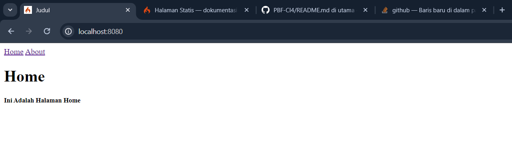
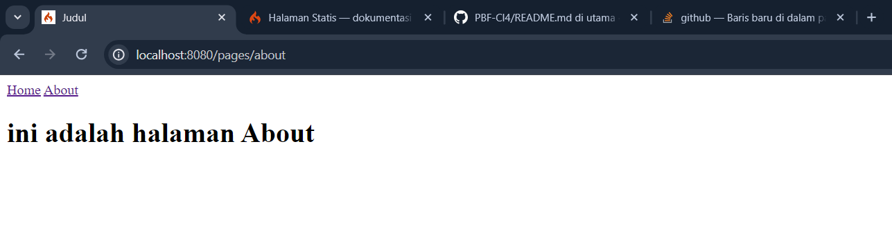


7. hdbvshbj

