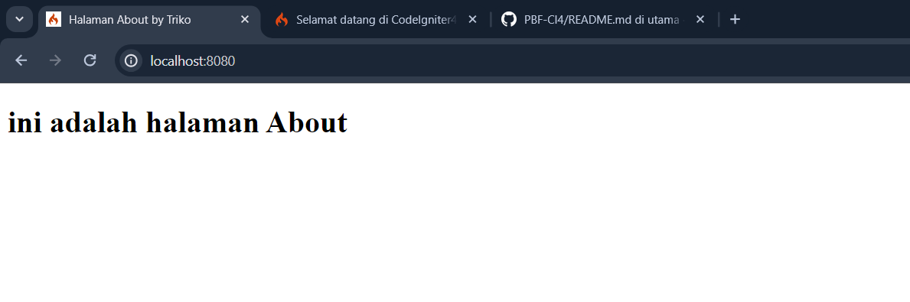

# CodeIgniter 4

## 1. Pengertian CodeIgniter

CodeIgniter adalah sebuah framework aplikasi berbasis PHP yang digunakan untuk membangun aplikasi WEB. Framework ini dirancang untuk memudahkan pengembangan aplikasi dengan menyediakan alat dan struktur dasar yang telah siap pakai. Dengan CodeIgniter, pengembang dapat mengembangkan aplikasi web dengan cepat dan efisien karena framework ini menyediakan fitur-fitur seperti manajemen database, pengelolaan URL dan sistem templating. [CodeIgniter 4](https://codeigniter.com).
<br />
<br />

## 2. Instal CodeIgniter Menggunakan Composer

CodeIgniter memiliki dua metode instalasi, yang pertama bisa download secara manual dan yang kedua menggunakan Composer. Disini saya rekomendasikan download CodeIgniter menggunakan Composer karena dapat diperbarui dengan mudah. Caranya yaitu :

A. Instal [Komposer](https://getcomposer.org/)
B. Create CodeIgniter dengan mengetikan perintah dibawah ini pada terminal.

```
composer create-project codeigniter4/appstarter Nama-Project
```

C. Jalankan Server lokal CodeIgniter dengan perintah dibawah ini

```
php spark serve
```

D. Jalankan Project tersebut dengan cara buka browser lalu isikan (http://localhost:8080)
   

<br />
<br />

## 3. Konfigurasi Awal

untuk mengkonfigurasi $bashURL dapat dilakukan dengan buka project CI tadi, bisa menggunakan Visual Studio Code. lalu pergi ke app/config/app.php. disitu $bashURLnya dapat diubah sesuai URL yang dikehendaki. namun cara tersebut kurang efisien karena jika kita akan mengkonfigurasi data base dan lainya harus mencari satu-satu dari folder tersebut. lalu bagaimana cara yang lebih efisien? disini saya gunakan env yang sudah disediakan. cara menggunakanya yaitu ubah file env menjadi .env , lalu hilangkan komentar atau # lalu ubah sesuai kebutuhan.


disini saya ubah CI_ENVIRONMEN = produktion menjadi developmen , gunanya yaitu supaya dalam membuat atau mengembangkan aplikasi tersebut maka jika terjadi kesalahan akan muncul eror dibagianmana pada tampilan wibesitenya
lalu menambahkan $bashURL

<br />
<br />

## 4. Aturan Perutean
```
<?php

use CodeIgniter\Router\RouteCollection;

/**
 * @var RouteCollection $routes
 */
$routes->get('/', 'Home::index');

```
kode diatas adalah potongan dari file routes.php yang terletak di app/config/routes.php. maksud dari kode diatas yaitu setiap url yang kita jalankan yaitu localhost8080 maka defaultnya mengarahkan ke class Home method index. contohnya jika kita mengakses url localhost8080 maka akan tampil dibawah ini.

sebenarnya itu adalah http://localhost:8080/Home/index buktikan

jika eror atau not found tambahkan code dibawah ini
```
$routes->setAutoRoute(true);
```
maka akan tampil seperti semula karena pada dasarnya link tersebut mengarah ke clas Home method index.


<br />
<br />

## 5. Mengubah akses Route
untuk mengubah akses route yang tadinya 'Home::index' menjadi yang diinginkan misalnya halaman About maka langkah awal yaitu 
1. buat method baru pada Clas Home misal fungsi about dengan nilai kembalian view('about')
```
<?php

namespace App\Controllers;

class Home extends BaseController
{
    public function index(): string
    {
        return view('welcome_message');
    }

    public function about(): string
    {
        return view('about');
    }
}

```
2. buat file baru untuk mengembalikan nilai view yaitu about <br />
 <br />
lalu isikan dengan kode html karena disini masuk ke aturan MVC yaitu view. misal isianya seperti berikut
```
<!DOCTYPE html>
<html lang="en">
<head>
    <meta charset="UTF-8">
    <meta name="viewport" content="width=device-width, initial-scale=1.0">
    <title>Halaman About by Triko</title>
</head>
<body>
    <h1>ini adalah halaman About</h1>
</body>
</html>
```
3. lalu ubah aturan pada routesnya menjadi home::about karena kita akan menuju class home method about
```
$routes->get('/', 'Home::about');
```
maka tampilanya akan berubah menjadi Halaman About


<br />
<br />

## Repository Management

We use GitHub issues, in our main repository, to track **BUGS** and to track approved **DEVELOPMENT** work packages.
We use our [forum](http://forum.codeigniter.com) to provide SUPPORT and to discuss
FEATURE REQUESTS.

This repository is a "distribution" one, built by our release preparation script.
Problems with it can be raised on our forum, or as issues in the main repository.

## Server Requirements

PHP version 7.4 or higher is required, with the following extensions installed:

- [intl](http://php.net/manual/en/intl.requirements.php)
- [mbstring](http://php.net/manual/en/mbstring.installation.php)

> [!WARNING]
> The end of life date for PHP 7.4 was November 28, 2022.
> The end of life date for PHP 8.0 was November 26, 2023.
> If you are still using PHP 7.4 or 8.0, you should upgrade immediately.
> The end of life date for PHP 8.1 will be November 25, 2024.

Additionally, make sure that the following extensions are enabled in your PHP:

- json (enabled by default - don't turn it off)
- [mysqlnd](http://php.net/manual/en/mysqlnd.install.php) if you plan to use MySQL
- [libcurl](http://php.net/manual/en/curl.requirements.php) if you plan to use the HTTP\CURLRequest library
